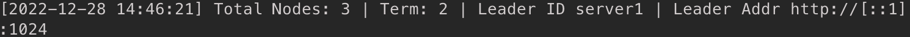
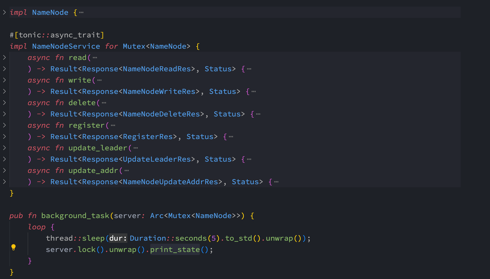
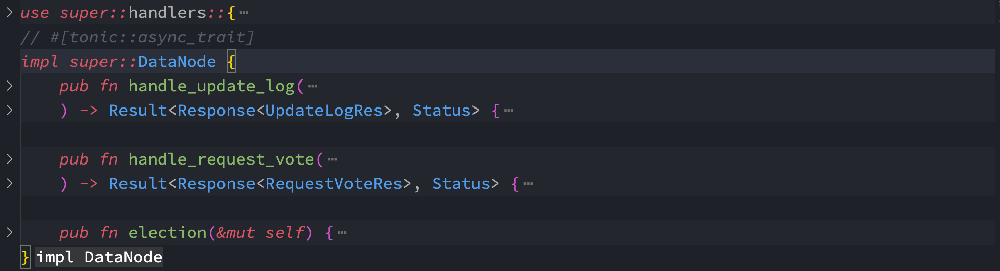
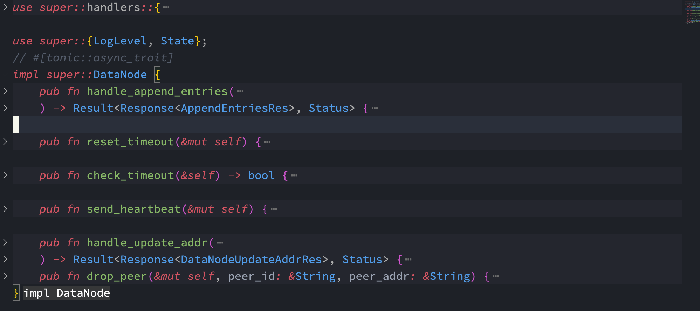

<p align='center' style="font-size:25pt">Raft 分布式文件系统</p>

---

<p align='center' style="font-size:15pt">大作业 </p>

<p style="font-size:15pt"><b>概要</b></p>

本次主要使用 rust 实现了 raft 分布式文件系统. 具体操作流程及讲解请看相应的录屏文件. 

github 链接: https://github.com/iridescentttt/raft_dfs

raft 中一共有两种节点: datanode & namenode. datanode 负责数据的存储, namenode 负责命名空间的管理. 

运行指令 

```c++
cargo run --bin namenode port // 在 port 端口运行 namenode

cargo run --bin datanode server_id port server_path // 在 port 端口运行 datanode, 该 datanode 存储的文件夹是在 server_path

cargo run --bin client read filename // 客户端读文件
cargo run --bin client write filename content// 客户端写文件
cargo run --bin client delete filename // 客户端删除文件
```


<p style="font-size:15pt"><b>protobuf</b></p>

在 proto/raft_dfs.proto 文件夹下. 主要定义了 datanode 和 namenode 的 rpc 接口.

编译使用 tonic_build 函数进行编译, 文件为 build.rs


<p style="font-size:15pt"><b>namenode</b></p>

使用上述命令启用 namenode, datanode 才能进行注册. 

namenode 日志包括总节点数以及 term_id, 和 leader的信息



namenode 实现架构.



namenode 实现的功能包括文件读写删除操作, 以及datanode 的注册以及 leader update 相关信息. 

- 在文件操作的时候具体逻辑是 client 会请求 namenode 得到相对应的 leader addr, 然后 client 请求 leader 进行文件读写. leader 写活着删除文件后会同步到其他 datanode 中. 

- 在选举出新的 leader 后, leader 会使用 update_leader request 更新 namenode 中的信息. 
- leader 在发送心跳包发现其他 datanode 宕机之后, 也会使用 update_addr request 更新 namenode 中的 datanode 信息. 


<p style="font-size:15pt"><b>Register</b></p>

新的 datanode 进入集群, 需要向 namenode 进行 register.

namenode 会返回所有 datanode 的 id 和地址. 如果存在 leader, 那么它也会返回 leader 的 id 和地址, 否则为 None. 

同时 namenode 也会向集群中的所有节点发送消息, 进行新节点的注册以及拓扑地址更新. 


<p style="font-size:15pt"><b>Election</b></p>

在 datanode 发现 timeout 后会进行选举. 具体在 datanode/vote.rs 文件中实现. 



datanode 调用 election 进行选举, 然后其他 datanode 使用 handle_request_vote 函数进行判断是否投给它.

如果成功当选了 leader, 他会更新其他 datanode 的日志信息, 其他 datanode 使用 handle_update_log 函数进行更新.


<p style="font-size:15pt"><b>Heartbeat</b></p>

Leader 会定期发送心跳包给 Follower. 具体在 datanode/heartbeat.rs 文件中实现. 



leader 调用 send_heartbeat 函数进行心跳包的发送, 然后其他 follower 使用 handle_append_entries 函数进行判断是否投给它.

follower 使用 reset_timeout 函数和 check_timeout 函数来进行 timeout 的处理. 

在 leader 发现其他 client 连不上去的时候, 会告知其他 follower 进行地址的更新. 其他 follower 使用 handle_update_addr 进行本地地址的更新. 


<p style="font-size:15pt"><b>Client</b></p>

具体在 client.rs 进行实现. 

使用本地 cache 文件当作缓存, 文件读写操作后都会在本地文件夹下进行更新. 


<p style="font-size:15pt"><b>文件锁</b></p>

在 datanode 进行写或者删除文件的时候会加文件锁. 具体在 datanode/mod.rs 中的 write 和 delete 函数.

使用的是 fs2::FileExt 包中的 lock_exclusive 函数和 unlock 函数. 


<p style="font-size:15pt"><b>心得</b></p>

第一次接触 rust,  比较难写, 报各种编译错误. 特别是异步的实现. 还有很多需要改进的地方, 以后有空的时候再改进吧. 
